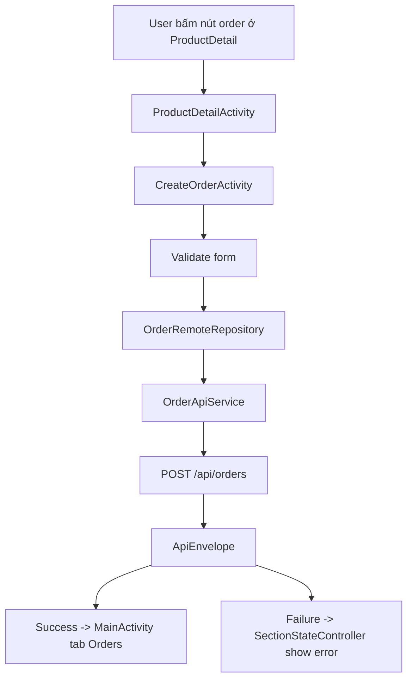

# Mobile Create Order Flow Bằng Java XML

## 1. Bối cảnh

Sau khi mobile app đã có:

- đăng nhập backend
- xem danh sách sản phẩm
- xem chi tiết sản phẩm
- lưu wishlist
- xem orders

thì phần còn thiếu quan trọng nhất là **tạo order thật**.

Nếu chưa có bước này, app mới chỉ dừng ở mức “xem dữ liệu”, chưa chạm vào luồng giao dịch chính.

## 2. Khái niệm chính

### `create order flow` là gì?

Đây là luồng mà người dùng:

1. đang xem một sản phẩm
2. chọn cách thanh toán ban đầu
3. gửi request lên backend để tạo order
4. sau đó theo dõi order ở tab `Orders`

Trong project này, backend đã có sẵn API:

- `POST /api/orders`

Mobile chỉ cần xây đúng form và gửi đúng request body.

### `payment option` là gì?

Backend hiện hỗ trợ:

- `partial`
- `full`

`partial` nghĩa là người dùng chỉ ứng trước một phần tiền.

`full` nghĩa là yêu cầu thanh toán toàn bộ giá trị của xe.

### `payment method` là gì?

Backend hiện có:

- `transfer`
- `cash`
- `online`

Mobile app chỉ cần gửi đúng chuỗi enum này trong request body.

## 3. Luồng runtime trong app

## Luồng 1: Từ Product Detail sang màn tạo order

1. Người dùng mở `ProductDetailActivity`.
2. Nếu sản phẩm là dữ liệu backend thật và người dùng đã có session backend, nút order sẽ mở `CreateOrderActivity`.
3. Nếu sản phẩm chỉ là demo preview, app không gửi request tạo order thật mà chỉ mở tab orders preview như cũ.
4. Nếu chưa đăng nhập backend, app báo rõ cần sign in.

Điểm này rất quan trọng vì nó tránh việc gửi request backend với dữ liệu giả.

## Luồng 2: Điền form create order

1. `CreateOrderActivity` nhận `Product` qua `Parcelable`.
2. App hiển thị:
   - tên xe
   - giá xe
   - payment option
   - payment method
   - upfront amount nếu chọn `partial`
3. Nếu người dùng chọn `full`, ô nhập upfront amount sẽ ẩn đi.
4. Nếu chọn `partial`, app gợi ý trước khoảng 20% giá xe để người dùng đỡ phải nghĩ từ đầu.

## Luồng 3: Submit order

1. Người dùng bấm `Create order request`.
2. `CreateOrderActivity` kiểm tra dữ liệu trước:
   - amount không được rỗng nếu là `partial`
   - amount phải lớn hơn 0
   - amount không được lớn hơn giá sản phẩm
3. Nếu hợp lệ, app gọi `OrderRemoteRepository.createOrder(...)`.
4. Repository dùng `OrderApiService` để gọi `POST /api/orders`.
5. Request body được gửi bằng `OrderCreateRequestBody`.
6. Backend xử lý và trả về `ApiEnvelope<RemoteOrderResponse>`.
7. Nếu thành công, app mở lại `MainActivity` ở tab `Orders`.
8. Nếu lỗi, `SectionStateController` hiển thị error state và cho phép `Retry`.

## 4. Cấu trúc request body trong mobile

Mobile hiện gửi các trường chính sau:

- `productId`
- `paymentOption`
- `paymentMethod`
- `upfrontAmount` nếu là `partial`
- `serviceFee = 0`

Ý tưởng ở đây là giữ request đơn giản nhất có thể, miễn là vẫn đúng contract backend.

## 5. Những file chính nên đọc

- `app/src/main/java/com/example/mobile_obs_asm/ProductDetailActivity.java`
- `app/src/main/java/com/example/mobile_obs_asm/CreateOrderActivity.java`
- `app/src/main/java/com/example/mobile_obs_asm/data/OrderRemoteRepository.java`
- `app/src/main/java/com/example/mobile_obs_asm/network/order/OrderApiService.java`
- `app/src/main/java/com/example/mobile_obs_asm/network/order/OrderCreateRequestBody.java`
- `app/src/main/java/com/example/mobile_obs_asm/network/order/RemoteOrderResponse.java`
- `app/src/main/java/com/example/mobile_obs_asm/util/ApiErrorMessageExtractor.java`
- `app/src/main/res/layout/activity_create_order.xml`

## 6. Sơ đồ luồng đơn giản

## 7. Vì sao màn create order được tách riêng?

Nếu nhét toàn bộ form order vào `ProductDetailActivity`, màn chi tiết sẽ bị ôm quá nhiều việc:

- hiển thị sản phẩm
- sync detail
- save wishlist
- validate order form
- gọi API tạo order

Tách riêng `CreateOrderActivity` giúp:

- detail screen gọn hơn
- form order rõ ràng hơn
- validation dễ đọc hơn
- loading/error state của submit dễ quản lý hơn

## 8. Sai lầm thường gặp

### Dùng product demo để gọi create order thật

Điều này thường sẽ fail vì backend product thật dùng `UUID`, còn dữ liệu demo của app dùng id giả như `road-001`.

Project này đã chặn điều đó bằng cách chỉ mở flow thật khi sản phẩm có `remoteSource = true`.

### Không validate upfront amount ở mobile

Backend vẫn sẽ validate, nhưng nếu mobile không kiểm tra trước thì trải nghiệm người dùng kém hơn vì:

- họ phải chờ request chạy rồi mới biết sai
- lỗi nhìn như lỗi server dù thực ra lỗi nằm ở input

### Không hiển thị trạng thái submit

Nếu người dùng bấm submit mà không thấy loading state, họ rất dễ bấm lặp nhiều lần.

Ở app này, nút submit bị disable và state card hiện loading trong lúc request đang chạy.

## 9. Điều quan trọng cần nhớ

Create order là bước đầu tiên biến app từ “xem marketplace” thành “thực hiện giao dịch”.

Nó cũng là ví dụ rất tốt cho người mới học Android vì trong một flow ngắn có đủ:

- điều hướng giữa các màn
- truyền model bằng `Parcelable`
- validate form
- gọi API bằng Retrofit
- hiển thị loading
- hiển thị error
- quay lại màn danh sách sau khi thành công
