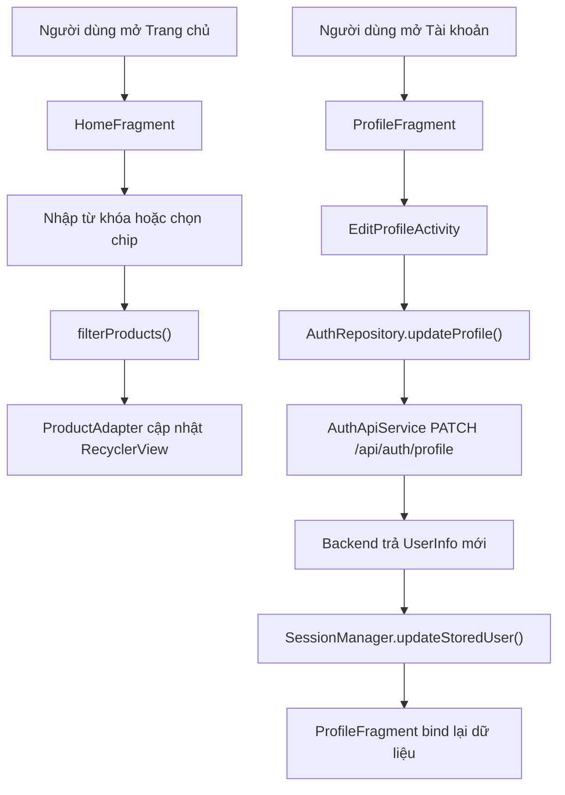

# Mobile Home Filter Và Edit Profile

## 1. Bối cảnh

Sau khi app đã có các màn chính như:

- đăng nhập
- xem danh sách xe
- lưu yêu thích
- tạo đơn

thì hai nhu cầu rất thực tế của người dùng là:

1. lọc danh sách xe cho nhanh
2. sửa lại hồ sơ cá nhân ngay trên điện thoại

Nếu thiếu hai phần này, app vẫn chạy được nhưng trải nghiệm còn khá “thô”.

## 2. Phần lọc ở Home là gì?

Trong project này, phần lọc ở Home gồm 2 lớp:

- lọc theo nhóm xe bằng `Chip`
- lọc theo từ khóa bằng ô tìm kiếm

Người dùng có thể:

- chạm `Đường trường`, `Địa hình nhẹ`, `Đi phố`, `Cổ điển`
- gõ tên xe, khu vực hoặc mô tả vào ô tìm kiếm

Hai lớp lọc này chạy cùng lúc.

Ví dụ:

- chọn `Đi phố`
- rồi gõ `Trek`

thì app chỉ giữ lại những xe vừa đúng nhóm `Đi phố`, vừa có từ khóa phù hợp.

## 3. Luồng runtime của bộ lọc Home

1. Người dùng mở tab Trang chủ.
2. `HomeFragment` tải dữ liệu sản phẩm từ `ProductRemoteRepository`.
3. Dữ liệu được lưu vào `sourceProducts`.
4. Khi người dùng chạm chip hoặc gõ ô tìm kiếm, `HomeFragment` cập nhật:
   - `selectedFilter`
   - `searchQuery`
5. `renderProductFeed()` chạy lại.
6. Hàm `filterProducts(...)` duyệt toàn bộ danh sách hiện có.
7. Mỗi sản phẩm phải qua 2 kiểm tra:
   - `matchesFilter(...)`
   - `matchesSearch(...)`
8. Nếu đạt cả hai điều kiện, sản phẩm được giữ lại.
9. `ProductAdapter` cập nhật `RecyclerView`.
10. `textHomeResultsSummary` hiển thị số lượng kết quả còn lại.

## 4. Vì sao phải chuẩn hóa chữ khi tìm kiếm?

Người dùng có thể gõ:

- `co dien`
- `cổ điển`
- `di pho`
- `đi phố`

Nếu app chỉ so sánh chuỗi thô, nhiều trường hợp sẽ không khớp.

Vì vậy `HomeFragment` có bước chuẩn hóa bằng `Normalizer` để:

- bỏ dấu tiếng Việt
- chuyển về chữ thường

Nhờ đó việc tìm kiếm dễ chịu hơn.

## 5. Những file chính của phần lọc

- `app/src/main/java/com/example/mobile_obs_asm/ui/home/HomeFragment.java`
- `app/src/main/res/layout/fragment_home.xml`
- `app/src/main/res/values/strings.xml`

Trong đó:

- `fragment_home.xml` thêm ô tìm kiếm và dòng tóm tắt kết quả
- `HomeFragment.java` xử lý logic lọc

## 6. Edit Profile là gì?

`Edit Profile` là màn cho người dùng sửa:

- họ và tên đệm
- tên
- số điện thoại
- địa chỉ giao dịch

Đây là thông tin quan trọng vì khi mua bán xe cũ, người dùng thường cần:

- liên hệ nhanh
- xác nhận nơi giao nhận
- cập nhật lại thông tin sau khi đổi số điện thoại hoặc địa chỉ

## 7. Luồng runtime của Edit Profile

1. Người dùng mở tab `Tài khoản`.
2. Từ `ProfileFragment`, người dùng bấm `Chỉnh sửa hồ sơ`.
3. App mở `EditProfileActivity`.
4. Activity đọc dữ liệu hiện tại từ `SessionManager` để điền sẵn vào form.
5. Người dùng sửa thông tin và bấm `Lưu thay đổi`.
6. `EditProfileActivity` gọi `AuthRepository.updateProfile(...)`.
7. `AuthRepository` dùng `AuthApiService` gọi:
   - `PATCH /api/auth/profile`
8. Backend trả về `UserInfo` mới.
9. `SessionManager.updateStoredUser(...)` ghi đè lại dữ liệu user trong local storage.
10. Activity đóng lại.
11. `ProfileFragment.onResume()` chạy lại và bind dữ liệu mới.

## 8. Những file chính của phần Edit Profile

- `app/src/main/java/com/example/mobile_obs_asm/EditProfileActivity.java`
- `app/src/main/res/layout/activity_edit_profile.xml`
- `app/src/main/java/com/example/mobile_obs_asm/ui/profile/ProfileFragment.java`
- `app/src/main/java/com/example/mobile_obs_asm/data/AuthRepository.java`
- `app/src/main/java/com/example/mobile_obs_asm/data/SessionManager.java`
- `app/src/main/java/com/example/mobile_obs_asm/network/auth/AuthApiService.java`
- `app/src/main/java/com/example/mobile_obs_asm/network/auth/ProfileUpdateRequestBody.java`

## 9. Vì sao phải cập nhật lại SessionManager sau khi sửa hồ sơ?

Nếu chỉ gửi API thành công mà không cập nhật local session, app sẽ gặp lỗi kiểu:

- backend đã có tên mới
- nhưng màn `Tài khoản` vẫn hiện tên cũ

Nói cách khác:

- dữ liệu trên server đúng
- nhưng dữ liệu trong app chưa đúng

Vì vậy sau khi backend trả về `UserInfo` mới, app phải ghi lại vào `SessionManager`.

## 10. Dọn copy “nói với dev” nghĩa là gì?

Một số câu cũ dùng các từ như:

- backend
- mô phỏng
- tham khảo kỹ thuật
- seller backend

Những từ đó không sai về mặt kỹ thuật, nhưng người dùng bình thường không cần đọc theo kiểu đó.

Trong đợt chỉnh sửa này, nhiều copy đã được đổi sang cách nói tự nhiên hơn, ví dụ:

- “địa chỉ kết nối của ứng dụng” thay vì “cấu hình máy chủ trong ứng dụng”
- “liên kết thanh toán” thay vì “liên kết thật từ backend”
- “xe gợi ý để làm quen” thay vì “mẫu tham khảo”

## 11. Sai lầm dễ gặp

### Sai lầm 1: Chỉ thêm UI lọc nhưng không đổi dữ liệu hiển thị

Nếu có chip hoặc ô tìm kiếm nhưng không chạy lại adapter, người dùng sẽ tưởng app bị hỏng.

### Sai lầm 2: Sửa hồ sơ xong nhưng không refresh màn Profile

Đây là lỗi rất thường gặp trong mobile app.

API thành công không có nghĩa UI tự cập nhật.

### Sai lầm 3: Tìm kiếm mà không xử lý dấu tiếng Việt

Người dùng Việt Nam rất dễ gõ có dấu hoặc không dấu lẫn lộn.

Nếu app không chuẩn hóa chuỗi, trải nghiệm tìm kiếm sẽ kém.

## 12. Sơ đồ luồng

## 13. Kết luận

Hai phần này tuy không lớn bằng order hay payment, nhưng rất quan trọng cho cảm giác “app dùng được thật”.

- Bộ lọc giúp người dùng tìm xe nhanh hơn.
- Edit profile giúp thông tin cá nhân không bị “đóng cứng” sau lần đăng nhập đầu tiên.

Đây là ví dụ điển hình cho việc cải thiện mobile app không phải lúc nào cũng là thêm tính năng lớn.

Nhiều khi chỉ cần:

- lọc tốt hơn
- câu chữ tự nhiên hơn
- form cá nhân chỉnh được

là trải nghiệm đã tiến lên rõ rệt.

## 14. Vì sao chip lọc có thể trả về rỗng với dữ liệu thật?

Lúc đầu, `HomeFragment` đoán nhóm xe bằng vài từ khóa cứng như:

- `road`
- `gravel`
- `city`
- `vintage`

Cách này chạy ổn với dữ liệu mẫu vì tiêu đề và mô tả đã được viết sẵn rất “đẹp”.

Nhưng với dữ liệu seller nhập thật, tiêu đề có thể chỉ là:

- `cccccc`
- `xe mới`
- `hàng đẹp`

hoặc mô tả quá ngắn.

Khi đó app không có đủ dấu hiệu để biết xe thuộc nhóm nào, nên nếu người dùng chạm chip, danh sách rất dễ bị lọc sạch.

## 15. Cách đã sửa trong project này

Đợt sửa này đổi bộ lọc sang kiểu “mềm” hơn:

1. App vẫn cố gắng nhận diện nhóm xe bằng từ khóa.
2. Nhưng chỉ dùng những trường ít nhiễu hơn:
   - `title`
   - `description`
   - `badge`
   - `condition`
   - `groupset`
3. App không còn dựa vào `tagline` sinh tự động của dữ liệu remote vì dòng này dễ làm lệch nhóm xe.
4. Nếu một tin chưa đủ dữ liệu để xếp vào:
   - `Đường trường`
   - `Địa hình nhẹ`
   - `Đi phố`
   - `Cổ điển`

thì tin đó được xem là `UNKNOWN`.

## 16. `UNKNOWN` nghĩa là gì?

`UNKNOWN` không phải lỗi dữ liệu.

Nó chỉ có nghĩa là:

- app chưa đủ thông tin để đoán chính xác nhóm xe
- nên không nên giấu mất tin đó ngay khi người dùng bấm chip

Vì vậy trong project này:

- xe thuộc đúng nhóm thì vẫn hiện
- xe chưa rõ nhóm cũng vẫn được giữ lại

Nhờ đó người dùng không rơi vào cảm giác:

- “vừa bấm chip là app trắng trơn”
- hoặc “tưởng backend không trả dữ liệu”

## 17. Luồng runtime mới của chip lọc

1. Người dùng chạm một chip trong `HomeFragment`.
2. `selectedFilter` được cập nhật.
3. `filterProducts(...)` duyệt từng `Product`.
4. `inferProductGroup(...)` đoán nhóm xe từ text thật của sản phẩm.
5. Nếu đoán ra:
   - `ROAD`
   - `GRAVEL`
   - `CITY`
   - `VINTAGE`

   thì app lọc đúng theo chip.
6. Nếu không đoán ra được, app gắn nhóm `UNKNOWN`.
7. `UNKNOWN` vẫn được giữ lại để tránh lọc rỗng toàn bộ danh sách.
8. `textHomeResultsSummary` hiển thị câu nhắc rằng có những xe “chưa đủ thông tin để xếp nhóm”.

## 18. File đã áp dụng

- `app/src/main/java/com/example/mobile_obs_asm/ui/home/HomeFragment.java`
- `app/src/main/res/values/strings.xml`

## 19. Sai lầm dễ gặp với filter kiểu nhóm xe

### Sai lầm 1: Tin rằng backend luôn có field category rõ ràng

Nhiều hệ thống bán hàng không lưu sẵn `bikeType`.

Nếu mobile tự giả định field này luôn có, bộ lọc rất dễ hỏng.

### Sai lầm 2: Dùng text sinh tự động để phân loại

Nếu app tự sinh tagline kiểu:

- “phù hợp đi lại hằng ngày”

thì gần như mọi xe đều có thể bị đẩy sang nhóm `Đi phố`.

### Sai lầm 3: Không xử lý trường hợp “chưa rõ nhóm”

Trong dữ liệu thật, luôn có một tỷ lệ sản phẩm mô tả quá ngắn hoặc nhập thiếu.

Nếu không có nhánh `UNKNOWN`, người dùng sẽ thấy quá nhiều màn hình rỗng.
