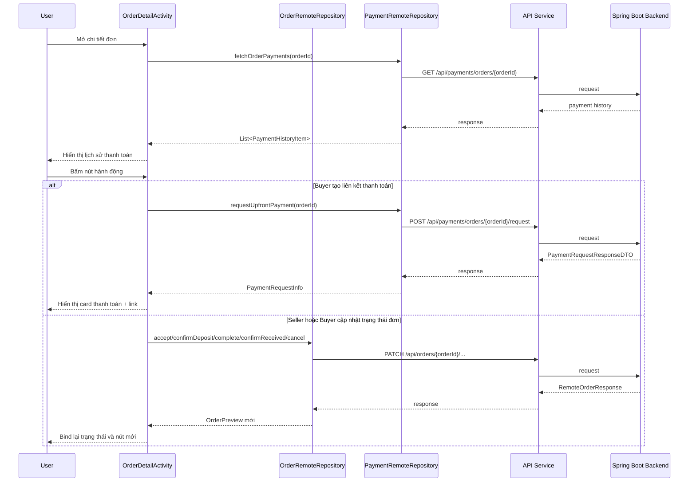

# Order Detail, Payment Flow Và Remove Wishlist Trong App Mobile

## 1. Bối cảnh

Sau khi app đã có:

- tạo order
- xem danh sách orders
- xem danh sách wishlist

thì vẫn còn ba khoảng trống dễ thấy:

1. người dùng chưa xem sâu được từng order
2. buyer và seller chưa có nút hành động đúng theo trạng thái đơn
3. wishlist chưa có luồng xoá đủ rõ

Nếu thiếu ba phần này, app sẽ giống bản xem thử giao diện hơn là một app mua bán có thể thao tác thật.

## 2. Khái niệm chính

### `Order Detail` là gì?

`Order Detail` là màn hình cho người dùng xem sâu hơn một order:

- trạng thái đơn
- trạng thái tiền
- phương thức thanh toán
- tổng tiền, tiền cọc, số tiền còn lại
- người mua, người bán
- deadline
- lịch sử thanh toán

Màn này quan trọng vì danh sách order chỉ trả lời câu hỏi “có đơn nào”, còn màn detail mới trả lời câu hỏi “bây giờ tôi phải làm gì tiếp theo”.

### `Payment Request` là gì?

Đây là bước buyer yêu cầu backend tạo thông tin thanh toán cho một order.

Trong project này, mobile gọi:

- `POST /api/payments/orders/{orderId}/request`

Backend sẽ trả về:

- số tiền cần thanh toán
- nội dung chuyển khoản
- tài khoản nhận tiền
- link checkout hoặc QR nếu có

### `Order Action` là gì?

Đây là các nút hành động phụ thuộc vào vai trò và trạng thái của order.

Ví dụ:

- seller có thể `tiếp nhận đơn`
- seller có thể `xác nhận đã nhận cọc`
- seller có thể `xác nhận đã giao xe`
- buyer có thể `tạo liên kết thanh toán`
- buyer có thể `xác nhận đã nhận xe`
- cả hai bên chỉ được `huỷ đơn` ở một số trạng thái nhất định

## 3. Luồng runtime của Order Detail

### Bước cơ bản

1. Người dùng mở tab `Orders`.
2. `OrdersFragment` nạp danh sách vào `OrderAdapter`.
3. Người dùng bấm vào một item.
4. App mở `OrderDetailActivity`.
5. `OrderPreview` được truyền qua `Parcelable`.
6. `OrderDetailActivity` bind dữ liệu order lên hero card, phần thanh toán, phần người tham gia và phần hành động.

Điểm cần nhớ:

- app chưa có endpoint order detail riêng
- vì vậy detail được dựng từ dữ liệu đã có trong list response

Đây là cách làm hợp lý cho MVP vì đơn giản hơn mà vẫn đủ thông tin để tiếp tục thao tác.

## 4. Luồng runtime của Payment Request

Luồng này áp dụng khi buyer đang có order ở trạng thái:

- `pending`
- `awaiting_payment`
- không phải thanh toán `cash`

Trình tự chạy như sau:

1. Buyer mở `OrderDetailActivity`.
2. Màn hình tính ra nút chính là `Tạo liên kết thanh toán`.
3. Người dùng bấm nút đó.
4. `OrderDetailActivity` gọi `PaymentRemoteRepository.requestUpfrontPayment(...)`.
5. Repository dùng `PaymentApiService` để gọi `POST /api/payments/orders/{orderId}/request`.
6. Backend trả về `checkoutUrl`, `qrCodeUrl`, `transferContent`, `bankAccountNumber`, `amount`, `expiresAt`...
7. Repository map dữ liệu sang `PaymentRequestInfo`.
8. `OrderDetailActivity` hiển thị card `Yêu cầu thanh toán`.
9. Nếu có link, người dùng có thể bấm `Mở trang thanh toán`.
10. Sau đó màn hình tải thêm `GET /api/payments/orders/{orderId}` để hiển thị lịch sử thanh toán bên dưới.

## 5. Luồng runtime của Order Action theo vai trò

### Seller flow

#### Tiếp nhận đơn

1. Seller mở `OrderDetailActivity`.
2. Nếu đơn đang là `pending` và tiền đang `unpaid`, app hiện nút `Tiếp nhận đơn`.
3. Khi bấm nút, app gọi:
   - `PATCH /api/orders/{orderId}/accept`
4. Backend cập nhật order.
5. Mobile nhận response mới, map lại sang `OrderPreview`.
6. UI bind lại toàn bộ status, timeline và action tiếp theo.

#### Xác nhận đã nhận cọc tiền mặt

1. Nếu payment method là `cash`, seller có thể xác nhận đã nhận cọc.
2. Mobile gọi:
   - `PATCH /api/orders/{orderId}/confirm-deposit`
3. Backend đổi order sang trạng thái đã đặt cọc.
4. UI cập nhật lại ngay trên màn detail.

#### Xác nhận đã giao xe

1. Khi order đã ở trạng thái `deposited`, seller có thể bấm `Xác nhận đã giao xe`.
2. Mobile gọi:
   - `PATCH /api/orders/{orderId}/complete`
3. Backend chuyển order sang bước chờ buyer xác nhận.
4. UI đổi nút hành động tương ứng.

### Buyer flow

#### Tạo liên kết thanh toán

Phần này đã giải thích ở mục 4.

#### Xác nhận đã nhận xe

1. Buyer mở `OrderDetailActivity`.
2. Nếu order ở trạng thái:
   - `awaiting_buyer_confirmation`
   - funding status là `held`
3. App hiện nút `Xác nhận đã nhận xe`.
4. Mobile gọi:
   - `PATCH /api/orders/{orderId}/confirm-received`
5. Backend hoàn tất giao dịch.
6. UI bind lại trạng thái cuối cùng.

### Huỷ đơn

Mobile không cho hiện nút huỷ ở các trạng thái đã quá muộn như:

- `deposited`
- `awaiting_buyer_confirmation`
- `completed`
- funding status `held`, `released`, `refunded`...

Điều này giúp UI không gợi ý hành động mà backend chắc chắn sẽ từ chối.

## 6. Luồng runtime của Remove Wishlist

### Trường hợp 1: Demo mode

1. Người dùng mở `Wishlist` bằng demo mode.
2. Danh sách lấy từ `FakeMarketplaceRepository`.
3. Người dùng bấm `Xoá`.
4. Adapter xoá item ngay trong list local.
5. App hiện toast báo đây chỉ là xoá cục bộ.

### Trường hợp 2: Backend session thật

1. Người dùng mở `Wishlist` khi đã đăng nhập.
2. `WishlistFragment` hiển thị dữ liệu thật.
3. Người dùng bấm `Xoá`.
4. `WishlistFragment` gọi `WishlistRemoteRepository.removeProduct(...)`.
5. Repository gọi:
   - `DELETE /api/wishlist/{productId}`
6. Nếu thành công, item bị xoá khỏi adapter.
7. Nếu danh sách rỗng, UI chuyển sang `empty state`.
8. Nếu lỗi, `SectionStateController` hiện `error state`.

## 7. Vì sao cần `OrderPreviewMapper`?

Backend trả về `RemoteOrderResponse`, nhưng UI không nên đọc object network trực tiếp ở mọi nơi.

Vì vậy project dùng `OrderPreviewMapper` để:

- đổi giá trị raw sang label dễ đọc
- chọn màu card theo trạng thái
- tính số tiền nên nổi bật trên UI
- gom thông tin người mua, người bán, timeline thành chuỗi dễ hiển thị

Điều này giúp:

- `OrdersFragment` và `OrderDetailActivity` không phải tự làm lại cùng một logic
- code gọn hơn
- thay đổi cách hiển thị chỉ cần sửa một chỗ

## 8. Những file chính nên đọc

- `app/src/main/java/com/example/mobile_obs_asm/OrderDetailActivity.java`
- `app/src/main/java/com/example/mobile_obs_asm/data/OrderRemoteRepository.java`
- `app/src/main/java/com/example/mobile_obs_asm/data/PaymentRemoteRepository.java`
- `app/src/main/java/com/example/mobile_obs_asm/network/order/OrderApiService.java`
- `app/src/main/java/com/example/mobile_obs_asm/network/payment/PaymentApiService.java`
- `app/src/main/java/com/example/mobile_obs_asm/model/OrderPreview.java`
- `app/src/main/java/com/example/mobile_obs_asm/model/PaymentRequestInfo.java`
- `app/src/main/java/com/example/mobile_obs_asm/model/PaymentHistoryItem.java`
- `app/src/main/java/com/example/mobile_obs_asm/util/OrderPreviewMapper.java`
- `app/src/main/res/layout/activity_order_detail.xml`

## 9. Sơ đồ luồng đơn giản

## 10. Sai lầm thường gặp

### Chỉ hiển thị danh sách order mà không có bước tiếp theo

Người dùng sẽ không biết sau khi xem order thì phải bấm gì để tiếp tục giao dịch.

### Để UI gợi ý hành động mà backend không cho phép

Ví dụ hiện nút `Huỷ đơn` khi order đã được giữ tiền. Người dùng bấm vào sẽ nhận lỗi và cảm thấy app thiếu tin cậy.

### Không tách lớp map dữ liệu

Nếu `Fragment` và `Activity` cùng tự xử lý raw status, app sẽ dễ bị lặp code và dễ hiển thị không đồng nhất.

### Không phân biệt demo mode và backend mode trong wishlist

Nếu demo mode vẫn cố gọi API thật, bạn sẽ gặp id giả và hành vi rất khó hiểu.

## 11. Điều quan trọng cần nhớ

Một màn `Order Detail` tốt không chỉ “show data”.

Nó phải trả lời được ba câu hỏi:

1. đơn đang ở bước nào
2. số tiền liên quan là bao nhiêu
3. người dùng phải làm gì tiếp theo

Lần cập nhật này giúp màn detail đi đúng hướng đó:

- có phần thanh toán rõ ràng hơn
- có lịch sử thanh toán
- có nút hành động theo buyer/seller
- có ràng buộc huỷ đơn gần với backend hơn
- wishlist cũng có luồng xoá rõ ràng để app bớt cảm giác chỉ là demo UI
