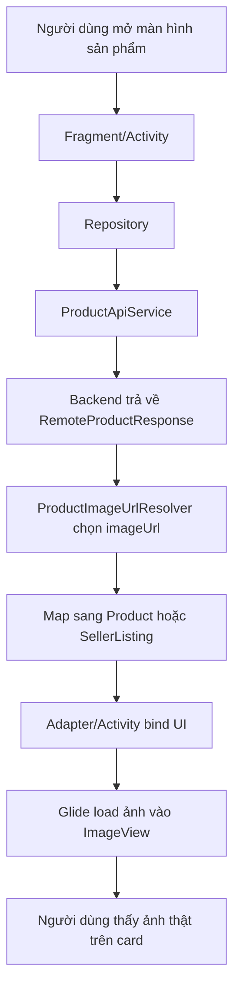

# Mobile Product Image Rendering With Glide

## 1. Bối cảnh

Trong app mobile của dự án này, backend đã trả về danh sách ảnh của xe trong API sản phẩm.

Ví dụ:

- `GET /api/products`
- `GET /api/products/{id}`
- `GET /api/wishlist`
- `GET /api/products/my`

Nhưng trước khi sửa, người dùng vẫn chỉ thấy:

- ô màu nền
- chữ cái viết tắt như `CC`, `AS`, `OB`

Điều này làm nhiều bạn dễ hiểu nhầm rằng backend chưa có ảnh. Thực tế không phải vậy.

## 2. Vấn đề thật sự là gì?

Vấn đề nằm ở phía mobile:

1. Model `Product` chưa có trường giữ URL ảnh.
2. Model `SellerListing` cũng chưa có URL ảnh.
3. Repository đã map tiêu đề, giá, mô tả, nhưng chưa map `imageUrl`.
4. Layout XML chưa có `ImageView` để hiện ảnh thật.
5. Adapter chỉ tô màu card và hiện chữ viết tắt.
6. App chưa dùng thư viện load ảnh như `Glide`.

Nói ngắn gọn:

`backend có ảnh` nhưng `mobile chưa biết lấy ảnh đó và đổ lên UI`.

## 3. Glide là gì?

`Glide` là thư viện Android chuyên dùng để tải và hiển thị ảnh.

Nó giúp app:

- tải ảnh từ URL
- cache ảnh
- giảm việc tự viết code network cho ảnh
- gắn ảnh vào `ImageView` rất nhanh

Ví dụ đơn giản:

```java
Glide.with(view)
        .load(imageUrl)
        .centerCrop()
        .into(imageView);
```

## 4. Luồng runtime của ảnh trong app

### Luồng 1: Danh sách sản phẩm ở Home

1. Người dùng mở tab Trang chủ.
2. `HomeFragment` gọi `ProductRemoteRepository.fetchProducts(...)`.
3. `ProductRemoteRepository` gọi `ProductApiService`.
4. Backend trả về `RemoteProductResponse`.
5. `ProductImageUrlResolver` chọn ảnh chính từ `images`.
6. Repository map dữ liệu sang `Product`.
7. `ProductAdapter` nhận `Product`.
8. `ProductAdapter` dùng `Glide` để đổ ảnh vào `imageProductCover`.
9. Card sản phẩm hiển thị ảnh thật.

### Luồng 2: Chi tiết sản phẩm

1. Người dùng bấm vào một sản phẩm.
2. `ProductDetailActivity` nhận `Product` qua `Intent`.
3. Nếu sản phẩm có `imageUrl`, activity dùng `Glide` để đổ vào `imageDetailCover`.
4. Nếu không có ảnh, app quay về placeholder chữ cái.

### Luồng 3: Danh sách tin của seller

1. Seller mở tab tin của tôi.
2. `SellerProductRemoteRepository` lấy dữ liệu sản phẩm từ backend.
3. Repository map ảnh chính sang `SellerListing`.
4. `SellerListingAdapter` dùng `Glide` để hiện ảnh trên card seller.

## 5. Những file đã thay đổi trong project này

### Model

- `app/src/main/java/com/example/mobile_obs_asm/model/Product.java`
- `app/src/main/java/com/example/mobile_obs_asm/model/SellerListing.java`

Hai model này đã được thêm trường `imageUrl`.

### Repository

- `app/src/main/java/com/example/mobile_obs_asm/data/ProductRemoteRepository.java`
- `app/src/main/java/com/example/mobile_obs_asm/data/WishlistRemoteRepository.java`
- `app/src/main/java/com/example/mobile_obs_asm/data/SellerProductRemoteRepository.java`

Các repository này giờ map URL ảnh từ backend vào model mobile.

### Utility

- `app/src/main/java/com/example/mobile_obs_asm/util/ProductImageUrlResolver.java`

Class này có nhiệm vụ:

- ưu tiên ảnh `primary = true`
- nếu không có ảnh primary thì lấy ảnh đầu tiên có URL hợp lệ

### UI và adapter

- `app/src/main/res/layout/item_product_card.xml`
- `app/src/main/res/layout/activity_product_detail.xml`
- `app/src/main/res/layout/item_seller_listing_card.xml`
- `app/src/main/java/com/example/mobile_obs_asm/ui/home/ProductAdapter.java`
- `app/src/main/java/com/example/mobile_obs_asm/ProductDetailActivity.java`
- `app/src/main/java/com/example/mobile_obs_asm/ui/seller/SellerListingAdapter.java`

Các file này được thêm:

- `ImageView`
- logic fallback khi không có ảnh
- `Glide.with(...).load(...)`

### Dependency

- `gradle/libs.versions.toml`
- `app/build.gradle.kts`

Hai file này được thêm dependency của `Glide`.

## 6. Vì sao vẫn cần placeholder chữ cái?

Không phải sản phẩm nào cũng chắc chắn có ảnh hợp lệ.

Ví dụ:

- backend chưa có ảnh
- URL ảnh bị trống
- người bán chưa upload

Nếu app chỉ trông chờ vào ảnh thật, màn hình sẽ bị trống hoặc vỡ bố cục.

Vì vậy app nên có 2 lớp:

1. Có ảnh thì hiện ảnh.
2. Không có ảnh thì hiện placeholder chữ cái và màu nền.

Đây là kiểu làm an toàn cho app mobile thật.

## 7. Sơ đồ luồng



## 8. Sai lầm dễ gặp

### Sai lầm 1: Nghĩ backend lỗi

Nhiều khi backend đã trả URL ảnh đúng, nhưng mobile chưa render.

Vì vậy trước khi kết luận, nên kiểm tra:

- API response có `images` hay không
- model mobile có trường `imageUrl` chưa
- layout có `ImageView` chưa
- adapter có load ảnh chưa

### Sai lầm 2: Có URL nhưng quên thêm thư viện load ảnh

Android không tự động đổ URL ảnh vào `ImageView` chỉ bằng `setText`.

Muốn hiển thị ảnh từ mạng, thường phải dùng thư viện như:

- Glide
- Picasso
- Coil

Trong project này, ta chọn `Glide`.

### Sai lầm 3: Không có fallback

Nếu chỉ hiện ảnh mà không có placeholder, UI sẽ xấu khi dữ liệu thiếu.

## 9. Kết luận

Lỗi “xe không hiện ảnh” trong task này không nằm ở backend.

Lỗi chính là mobile chưa hoàn thiện pipeline hiển thị ảnh.

Sau khi sửa:

- backend trả URL ảnh
- repository map URL vào model
- adapter và activity nhận `imageUrl`
- Glide tải ảnh vào `ImageView`
- fallback placeholder vẫn được giữ lại khi không có ảnh

Đây là một ví dụ rất điển hình cho việc:

`API có dữ liệu` chưa có nghĩa là `UI sẽ tự hiện đúng`.

Ở mobile, dữ liệu phải đi đủ các bước từ response đến model, rồi tới adapter và layout thì người dùng mới nhìn thấy kết quả.
