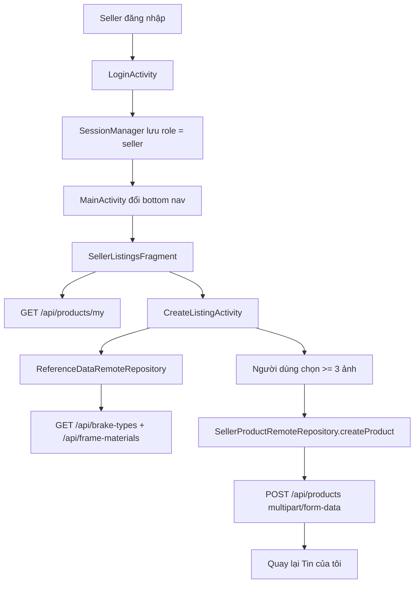

# Mobile Seller Flow Bằng Java XML

## 1. Bối cảnh

Trước khi làm nhánh này, app mobile chủ yếu đi theo luồng người mua:

- đăng nhập
- xem sản phẩm
- lưu yêu thích
- tạo order
- xem đơn mua

Điều đó dẫn tới một vấn đề lớn: nếu đăng nhập bằng tài khoản `seller`, người dùng vẫn rơi vào giao diện kiểu buyer và không có chỗ để đăng tin.

Nhánh này bổ sung phần còn thiếu đó:

- nhận biết tài khoản seller sau khi login
- đổi điều hướng đáy sang `Tin của tôi`
- tạo màn đăng tin thật
- lấy danh sách tin của seller từ backend
- cho seller ẩn tin hoặc gửi duyệt lại

## 2. Khái niệm chính

### `seller-aware navigation` là gì?

Đây là cách app thay đổi giao diện theo vai trò người dùng.

Trong project này:

- buyer vẫn thấy `Yêu thích` và `Đơn mua`
- seller sẽ thấy `Tin của tôi` và `Đơn bán`

Nói đơn giản, cùng một app nhưng shell điều hướng không còn cứng cho mọi role.

### `multipart upload` là gì?

`multipart/form-data` là kiểu request HTTP cho phép gửi:

- text field
- file ảnh

trong cùng một request.

Backend `POST /api/products` đang yêu cầu kiểu này vì tạo tin phải gửi cả thông tin xe và danh sách ảnh.

### `reference data` là gì?

Đây là dữ liệu dùng để chọn trong form, ví dụ:

- loại phanh
- chất liệu khung

Thay vì hardcode ID trong app, mobile lấy danh sách này từ backend rồi hiển thị lên dropdown.

## 3. Luồng runtime trong app

## Luồng 1: đăng nhập seller và đổi shell

1. Người dùng đăng nhập ở `LoginActivity`.
2. `AuthRepository` gọi API login.
3. `SessionManager` lưu token, `userId`, và `role`.
4. `LoginActivity` không còn luôn nhảy về `Home`, mà gọi `MainActivity.defaultStartDestination(...)`.
5. Nếu role là seller, app mở thẳng tab `Tin của tôi`.
6. `MainActivity` đổi label bottom navigation:
   - `Yêu thích` -> `Tin của tôi`
   - `Đơn mua` -> `Đơn bán`

File chính:

- `app/src/main/java/com/example/mobile_obs_asm/LoginActivity.java`
- `app/src/main/java/com/example/mobile_obs_asm/MainActivity.java`
- `app/src/main/java/com/example/mobile_obs_asm/data/SessionManager.java`

## Luồng 2: mở danh sách tin của seller

1. Seller vào tab `Tin của tôi`.
2. `MainActivity` không mở `WishlistFragment` nữa, mà mở `SellerListingsFragment`.
3. `SellerListingsFragment` gọi `SellerProductRemoteRepository.fetchMyProducts(...)`.
4. Repository gọi `GET /api/products/my`.
5. Backend trả về page sản phẩm của seller hiện tại.
6. Repository map dữ liệu thành `SellerListing`.
7. `SellerListingAdapter` render từng card trong `RecyclerView`.

File chính:

- `app/src/main/java/com/example/mobile_obs_asm/ui/seller/SellerListingsFragment.java`
- `app/src/main/java/com/example/mobile_obs_asm/ui/seller/SellerListingAdapter.java`
- `app/src/main/java/com/example/mobile_obs_asm/data/SellerProductRemoteRepository.java`
- `app/src/main/java/com/example/mobile_obs_asm/network/product/ProductApiService.java`

## Luồng 3: mở form đăng tin

1. Seller bấm `Đăng tin mới`.
2. App mở `CreateListingActivity`.
3. Activity kiểm tra ngay xem session hiện tại có phải seller không.
4. Nếu không phải seller, app báo lỗi và đóng màn hình.
5. Nếu đúng role, app tải lookup data cho form:
   - loại phanh
   - chất liệu khung

Luồng dữ liệu:

`user action -> CreateListingActivity -> ReferenceDataRemoteRepository -> ReferenceDataApiService -> backend -> dropdown`

File chính:

- `app/src/main/java/com/example/mobile_obs_asm/CreateListingActivity.java`
- `app/src/main/java/com/example/mobile_obs_asm/data/ReferenceDataRemoteRepository.java`
- `app/src/main/java/com/example/mobile_obs_asm/network/reference/ReferenceDataApiService.java`

## Luồng 4: chọn ảnh và submit form

1. Seller bấm `Chọn ảnh`.
2. `ActivityResultLauncher<GetMultipleContents>` mở picker ảnh hệ thống.
3. App nhận về danh sách `Uri`.
4. `CreateListingActivity` giữ các `Uri` này trong bộ nhớ tạm.
5. Khi submit, app validate:
   - tiêu đề
   - giá bán
   - tỉnh/thành
   - cỡ khung
   - kích thước bánh
   - tình trạng xe
   - loại phanh
   - chất liệu khung
   - ít nhất 3 ảnh
6. Nếu hợp lệ, activity tạo `CreateListingDraft`.
7. `SellerProductRemoteRepository.createProduct(...)` đọc byte từ từng `Uri`.
8. Repository tạo `MultipartBody.Part` cho danh sách ảnh.
9. Repository gửi `POST /api/products` với `multipart/form-data`.
10. Backend tạo sản phẩm mới và trả về response.
11. App điều hướng về `Tin của tôi`.

## Luồng 5: ẩn tin hoặc gửi duyệt lại

1. Seller bấm nút trên card tin đăng.
2. Nếu trạng thái hiện tại là `hidden`, app gọi `showProduct(...)`.
3. Nếu trạng thái khác `hidden`, app gọi `hideProduct(...)`.
4. Backend xử lý:
   - `hide` chuyển tin sang `hidden`
   - `show` chuyển tin từ `hidden` về `pending`
5. Sau khi thành công, app tải lại danh sách.

Điểm quan trọng:

- `show` không làm tin active ngay
- backend chuyển về `pending`, nghĩa là seller đang gửi duyệt lại

## 4. Vì sao phải chọn ít nhất 3 ảnh?

Backend hiện có rule thật trong service:

- nếu số ảnh hợp lệ nhỏ hơn 3 thì từ chối tạo tin

Vì vậy mobile không thể chỉ gửi text. Nếu không thêm picker ảnh, seller flow sẽ có giao diện nhưng không dùng được.

Đây là ví dụ rất điển hình cho bài học:

> Không được nhìn controller rồi đoán feature đã đủ.

Phải kiểm tra thêm service rule phía sau controller.

## 5. Những file chính nên đọc

- `app/src/main/java/com/example/mobile_obs_asm/MainActivity.java`
- `app/src/main/java/com/example/mobile_obs_asm/LoginActivity.java`
- `app/src/main/java/com/example/mobile_obs_asm/CreateListingActivity.java`
- `app/src/main/java/com/example/mobile_obs_asm/data/SessionManager.java`
- `app/src/main/java/com/example/mobile_obs_asm/data/SellerProductRemoteRepository.java`
- `app/src/main/java/com/example/mobile_obs_asm/data/ReferenceDataRemoteRepository.java`
- `app/src/main/java/com/example/mobile_obs_asm/model/CreateListingDraft.java`
- `app/src/main/java/com/example/mobile_obs_asm/model/SellerListing.java`
- `app/src/main/java/com/example/mobile_obs_asm/ui/seller/SellerListingsFragment.java`
- `app/src/main/java/com/example/mobile_obs_asm/ui/seller/SellerListingAdapter.java`
- `app/src/main/res/layout/activity_create_listing.xml`
- `app/src/main/res/layout/fragment_seller_listings.xml`
- `app/src/main/res/layout/item_seller_listing_card.xml`

## 6. Sơ đồ luồng đơn giản

## 7. Sai lầm thường gặp

### Chỉ đổi text UI mà không đổi navigation

Nếu chỉ đổi chữ `Yêu thích` thành `Tin của tôi` nhưng vẫn mở `WishlistFragment`, seller sẽ thấy sai hoàn toàn luồng.

Trong project này phải đổi cả:

- label menu
- fragment được mở
- toolbar title
- profile action

### Quên lưu `role` hoặc `userId` trong session

Nếu session chỉ lưu token mà không lưu role, app rất khó đổi giao diện theo loại tài khoản.

### Không kiểm tra service rule về ảnh tối thiểu

Đây là lỗi rất dễ gặp khi chỉ nhìn `ProductController`.

Controller cho thấy có endpoint tạo tin, nhưng service mới là nơi giữ luật nghiệp vụ thật.

### Gửi request tạo tin mà không dùng `multipart`

Nếu backend yêu cầu `multipart/form-data`, mobile phải gửi đúng kiểu đó. Gửi JSON thông thường sẽ fail.

## 8. Điều quan trọng cần nhớ

Nhánh seller flow này là ví dụ tốt cho tư duy full-stack mobile:

- người dùng bấm nút trong app
- activity hoặc fragment nhận sự kiện
- repository điều phối dữ liệu
- API service gọi backend
- backend áp luật nghiệp vụ
- UI cập nhật lại theo response thật

Khi học Android với project có backend, em nên luôn lần theo luồng theo thứ tự:

`user action -> activity/fragment -> repository -> api service -> backend -> response -> UI`
