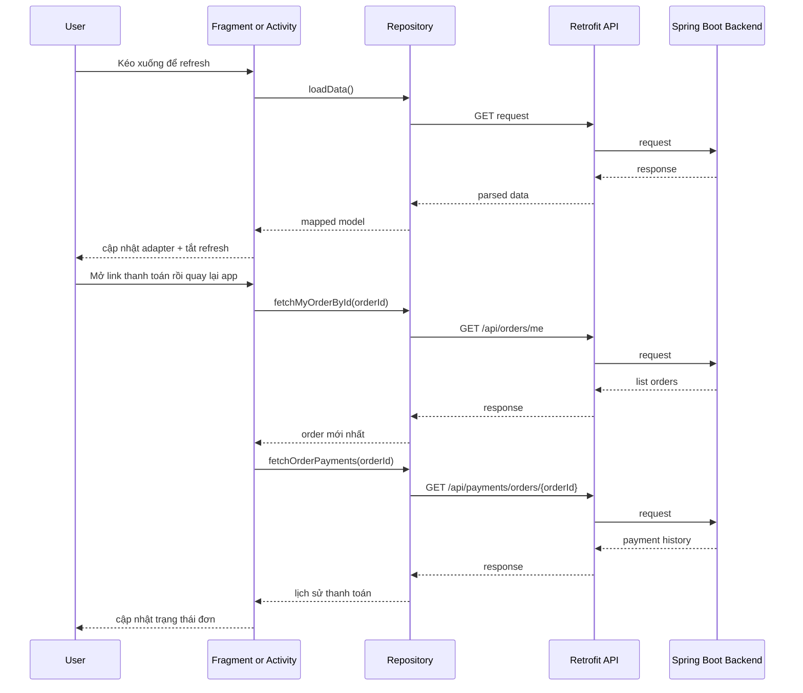

# Session Hết Hạn, Pull To Refresh Và Seller Edit/Delete Trong App Mobile

## 1. Bối cảnh

Sau khi app đã có:

- login và register
- buyer flow cơ bản
- seller tạo tin
- order detail và payment request

thì vẫn còn một số vấn đề rất thực tế:

1. người dùng mở link thanh toán rồi quay lại app nhưng trạng thái order chưa tự cập nhật
2. danh sách `Home`, `Wishlist`, `Orders`, `Seller Listings` chưa có thao tác kéo xuống để làm mới
3. seller mới chỉ tạo tin và ẩn/hiện, chưa sửa hoặc xoá được
4. khi token hết hạn, mỗi màn có thể phản ứng khác nhau và gây rối trải nghiệm

Nhánh này xử lý các phần còn thiếu đó.

## 2. Khái niệm chính

### `pull to refresh` là gì?

Đây là thao tác người dùng kéo màn hình từ trên xuống để yêu cầu app tải lại dữ liệu mới nhất.

Trong Android XML truyền thống, thành phần hay dùng là:

- `SwipeRefreshLayout`

### `session expired` là gì?

Đây là tình huống token đăng nhập không còn hợp lệ nữa.

Ví dụ:

- token hết hạn
- token bị thu hồi
- backend trả `401` hoặc `403`

Nếu app không xử lý thống nhất, người dùng sẽ thấy mỗi màn một kiểu lỗi.

### `seller edit/delete` là gì?

Đây là phần seller chỉnh sửa hoặc xoá một tin đang quản lý.

Trong project này, mobile nối đúng với backend hiện có:

- `GET /api/products/my/{id}`
- `PUT /api/products/{id}`
- `DELETE /api/products/{id}`

Lưu ý:

- backend không có endpoint riêng để seller tự bấm `mark sold`
- trạng thái `sold` được backend tự set khi order hoàn tất

## 3. Luồng session hết hạn trong app

### Mục tiêu

Khi bất kỳ request nào đang dùng token gặp `401/403`, app cần:

1. xoá session cũ
2. báo cho activity hiện tại biết
3. đưa người dùng về login

### Luồng runtime

1. Người dùng đang ở một màn cần đăng nhập, ví dụ `MainActivity` hoặc `OrderDetailActivity`.
2. App gọi API qua Retrofit.
3. `AuthHeaderInterceptor` gắn token vào request.
4. Backend trả về `401` hoặc `403`.
5. `AuthHeaderInterceptor` phát hiện response này.
6. Interceptor gọi `SessionManager.clearSession()`.
7. Interceptor phát một event bằng `SessionExpiryNotifier`.
8. Các activity đang mở và kế thừa `SessionAwareActivity` nhận event này.
9. App hiển thị toast ngắn rồi điều hướng về `LoginActivity`.

### File chính

- `app/src/main/java/com/example/mobile_obs_asm/network/AuthHeaderInterceptor.java`
- `app/src/main/java/com/example/mobile_obs_asm/util/SessionExpiryNotifier.java`
- `app/src/main/java/com/example/mobile_obs_asm/SessionAwareActivity.java`
- `app/src/main/java/com/example/mobile_obs_asm/data/SessionManager.java`

## 4. Luồng refresh order sau khi quay lại từ payment

### Vấn đề trước đây

Buyer bấm mở link thanh toán từ `OrderDetailActivity`, đi ra ngoài app, rồi quay lại.

Lúc đó:

- order có thể đã đổi trạng thái ở backend
- payment history có thể đã có thêm bản ghi

nhưng màn detail chưa tự làm mới.

### Luồng mới

1. Người dùng mở `OrderDetailActivity`.
2. Activity bind dữ liệu order hiện có.
3. Khi activity quay lại `onResume`, nếu đây không phải lần resume đầu tiên và order là dữ liệu thật:
   - app gọi `OrderRemoteRepository.fetchMyOrderById(...)`
4. Repository thực chất đọc lại `GET /api/orders/me`, rồi tìm order có `id` tương ứng.
5. Nếu thấy order:
   - map lại thành `OrderPreview`
   - bind lại toàn bộ status, funding status, action button
6. Sau đó activity gọi tiếp `PaymentRemoteRepository.fetchOrderPayments(...)`
7. UI cập nhật lại card yêu cầu thanh toán và lịch sử thanh toán.

### Vì sao lại đọc từ `GET /api/orders/me`?

Vì backend hiện chưa có endpoint `GET /api/orders/{id}` riêng cho mobile.

Cho nên mobile làm theo cách:

- lấy toàn bộ danh sách order của user
- lọc đúng `id` đang mở

Đây là cách chấp nhận được cho MVP.

### File chính

- `app/src/main/java/com/example/mobile_obs_asm/OrderDetailActivity.java`
- `app/src/main/java/com/example/mobile_obs_asm/data/OrderRemoteRepository.java`
- `app/src/main/java/com/example/mobile_obs_asm/data/PaymentRemoteRepository.java`

## 5. Luồng pull to refresh cho các màn chính

Nhánh này thêm `SwipeRefreshLayout` cho:

- `Home`
- `Wishlist`
- `Orders`
- `Seller Listings`

### Luồng runtime chung

1. Người dùng kéo màn hình từ trên xuống.
2. `SwipeRefreshLayout` gọi lại hàm load của fragment.
3. Fragment gọi repository tương ứng.
4. Khi request xong:
   - cập nhật adapter
   - ẩn trạng thái refresh
   - cập nhật `SectionStateController`

### File chính

- `app/src/main/res/layout/fragment_home.xml`
- `app/src/main/res/layout/fragment_wishlist.xml`
- `app/src/main/res/layout/fragment_orders.xml`
- `app/src/main/res/layout/fragment_seller_listings.xml`
- `app/src/main/java/com/example/mobile_obs_asm/ui/home/HomeFragment.java`
- `app/src/main/java/com/example/mobile_obs_asm/ui/wishlist/WishlistFragment.java`
- `app/src/main/java/com/example/mobile_obs_asm/ui/orders/OrdersFragment.java`
- `app/src/main/java/com/example/mobile_obs_asm/ui/seller/SellerListingsFragment.java`

## 6. Seller edit/delete flow

### Luồng sửa tin

1. Seller mở tab `Tin của tôi`.
2. `SellerListingsFragment` hiển thị từng card với các nút:
   - `Sửa tin`
   - `Ẩn tin` hoặc `Gửi duyệt lại`
   - `Xoá tin`
3. Người dùng bấm `Sửa tin`.
4. App mở lại `CreateListingActivity` nhưng ở `editMode`.
5. Activity tải:
   - reference data cho dropdown
   - chi tiết tin từ `GET /api/products/my/{id}`
6. Form tự điền dữ liệu cũ.
7. Người dùng sửa thông tin rồi bấm lưu.
8. Activity tạo `CreateListingDraft`.
9. Repository gọi `PUT /api/products/{id}` bằng `multipart/form-data`.
10. Backend cập nhật product và đưa tin về trạng thái `pending`.
11. App quay lại danh sách seller.

### Lưu ý về ảnh

Backend có rule quan trọng:

- nếu gửi ảnh mới trong request update thì phải đủ ít nhất 3 ảnh
- nếu không gửi ảnh mới thì backend giữ bộ ảnh cũ

Vì vậy mobile phải chia rõ hai trường hợp:

- edit không chọn ảnh mới: hợp lệ
- edit có chọn ảnh mới nhưng dưới 3 ảnh: không hợp lệ

### Luồng xoá tin

1. Seller bấm `Xoá tin`.
2. App hiện `MaterialAlertDialog`.
3. Nếu xác nhận, fragment gọi `SellerProductRemoteRepository.deleteProduct(...)`.
4. Repository gọi `DELETE /api/products/{id}`.
5. Backend đánh dấu xoá mềm.
6. App tải lại danh sách seller.

## 7. Vì sao seller không có nút “Đã bán” riêng?

Backend có enum `ProductStatus.sold`, nhưng mobile không nên tự ý thêm nút nếu server không có endpoint seller tương ứng.

Trong backend hiện tại:

- seller có `hide/show/update/delete`
- product chuyển sang `sold` khi order đi tới bước hoàn tất

Nghĩa là:

- `sold` là kết quả của order flow
- không phải thao tác seller tự bấm trực tiếp trên listing

Đây là bài học rất quan trọng:

> Không phải cứ thấy enum tồn tại là mobile được quyền tạo nút thao tác tương ứng.

Phải kiểm tra xem controller và service có cho phép hành động đó hay không.

## 8. Các file chính nên đọc

- `app/src/main/java/com/example/mobile_obs_asm/SessionAwareActivity.java`
- `app/src/main/java/com/example/mobile_obs_asm/network/AuthHeaderInterceptor.java`
- `app/src/main/java/com/example/mobile_obs_asm/util/SessionExpiryNotifier.java`
- `app/src/main/java/com/example/mobile_obs_asm/OrderDetailActivity.java`
- `app/src/main/java/com/example/mobile_obs_asm/data/OrderRemoteRepository.java`
- `app/src/main/java/com/example/mobile_obs_asm/CreateListingActivity.java`
- `app/src/main/java/com/example/mobile_obs_asm/data/SellerProductRemoteRepository.java`
- `app/src/main/java/com/example/mobile_obs_asm/ui/seller/SellerListingsFragment.java`
- `app/src/main/java/com/example/mobile_obs_asm/ui/seller/SellerListingAdapter.java`

## 9. Sơ đồ luồng đơn giản

## 10. Sai lầm thường gặp

### Chỉ thêm pull-to-refresh trong XML mà quên tắt trạng thái refresh

Khi đó vòng tròn loading sẽ quay mãi dù request đã xong.

### Mỗi màn xử lý `401` một kiểu

Điều này làm người dùng rất khó hiểu:

- màn thì toast
- màn thì state card
- màn thì im lặng

Giải pháp tốt hơn là gom lại ở interceptor + activity base class.

### Cho seller sửa tin đang bị khoá giao dịch

Backend hiện chặn sửa/xoá khi product đang gắn với giao dịch hoạt động.

Nếu mobile vẫn hiện nút như bình thường, người dùng sẽ bấm vào rồi nhận lỗi từ server.

### Tự ý thêm nút `Đã bán`

Nếu backend không có endpoint seller tương ứng, nút đó chỉ làm app nhìn có vẻ nhiều tính năng hơn nhưng không dùng thật được.

## 11. Điều quan trọng cần nhớ

Khi app mobile bắt đầu có nhiều màn và nhiều flow thật, điều quan trọng không chỉ là “API gọi được”.

App còn phải:

1. biết lúc nào nên tự làm mới dữ liệu
2. xử lý thống nhất khi session hết hạn
3. không gợi ý hành động mà backend không hỗ trợ
4. cho người dùng thao tác refresh và quản lý dữ liệu một cách tự nhiên

Đó là lý do nhánh này tập trung vào:

- `refresh`
- `auth robustness`
- `seller management`

thay vì chỉ thêm thêm màn mới.
