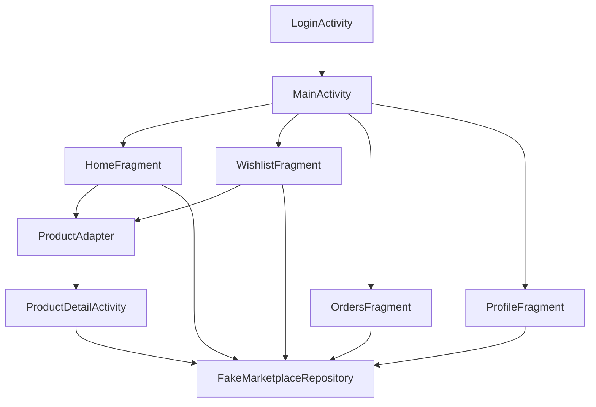

# UI Skeleton Mobile Java XML - Luồng Cơ Bản

## 1. Bối cảnh

Dự án mobile này đang ở giai đoạn đầu nên chưa nối API thật ngay.
Vì vậy, bước đầu tiên hợp lý là dựng một **UI skeleton**.

`UI skeleton` có thể hiểu đơn giản là bộ khung giao diện cơ bản:

- có màn hình đăng nhập
- có màn chính
- có điều hướng giữa các tab
- có danh sách sản phẩm
- có trang chi tiết
- có màn wishlist, orders, profile

Nhờ vậy, ta nhìn được ứng dụng sẽ chạy theo hướng nào trước khi gắn backend thật.

## 2. Khái niệm chính

### UI skeleton là gì?

UI skeleton là phiên bản giao diện chưa hoàn chỉnh về dữ liệu thật nhưng đã có:

- bố cục màn hình
- cách chuyển màn
- dữ liệu giả để bấm thử
- cảm giác sử dụng gần giống app thật

### Fake repository là gì?

`Fake repository` là lớp cung cấp dữ liệu giả.

Thay vì gọi API thật, nó trả về danh sách xe đạp, đơn hàng, và thông tin người dùng được viết sẵn trong code.

Điều này giúp:

- làm UI nhanh hơn
- tách việc dựng giao diện khỏi việc gọi API
- giảm lỗi ở giai đoạn đầu

## 3. Vì sao cách làm này quan trọng?

Nếu vừa dựng giao diện vừa gọi API thật ngay từ đầu, bạn sẽ dễ bị kẹt ở nhiều chỗ cùng lúc:

- layout chưa ổn
- điều hướng chưa rõ
- dữ liệu backend chưa khớp
- khó biết lỗi nằm ở UI hay API

Làm UI skeleton trước giúp chia bài toán ra thành hai phần:

1. giao diện và trải nghiệm
2. dữ liệu thật và networking

## 4. Ví dụ nhỏ

Giả sử người dùng bấm vào một chiếc xe ở màn Home.

Luồng cơ bản sẽ là:

1. `RecyclerView` hiển thị danh sách
2. người dùng chạm vào một item
3. adapter bắt sự kiện click
4. app mở `ProductDetailActivity`
5. `ProductDetailActivity` lấy dữ liệu từ `FakeMarketplaceRepository`
6. màn chi tiết hiển thị thông tin xe

Ở giai đoạn này, chưa cần backend thật nhưng người dùng vẫn bấm thử được toàn bộ luồng.

## 5. Áp dụng trong project này

Các file chính:

- `app/src/main/java/com/example/mobile_obs_asm/LoginActivity.java`
- `app/src/main/java/com/example/mobile_obs_asm/MainActivity.java`
- `app/src/main/java/com/example/mobile_obs_asm/ProductDetailActivity.java`
- `app/src/main/java/com/example/mobile_obs_asm/ui/home/HomeFragment.java`
- `app/src/main/java/com/example/mobile_obs_asm/ui/home/ProductAdapter.java`
- `app/src/main/java/com/example/mobile_obs_asm/ui/wishlist/WishlistFragment.java`
- `app/src/main/java/com/example/mobile_obs_asm/ui/orders/OrdersFragment.java`
- `app/src/main/java/com/example/mobile_obs_asm/ui/profile/ProfileFragment.java`
- `app/src/main/java/com/example/mobile_obs_asm/data/FakeMarketplaceRepository.java`

Các layout chính:

- `app/src/main/res/layout/activity_login.xml`
- `app/src/main/res/layout/activity_main.xml`
- `app/src/main/res/layout/activity_product_detail.xml`
- `app/src/main/res/layout/fragment_home.xml`
- `app/src/main/res/layout/fragment_wishlist.xml`
- `app/src/main/res/layout/fragment_orders.xml`
- `app/src/main/res/layout/fragment_profile.xml`
- `app/src/main/res/layout/item_product_card.xml`
- `app/src/main/res/layout/item_order_card.xml`

## 6. Luồng runtime trong app

### Luồng 1: Đăng nhập demo

1. Người dùng mở app.
2. `LoginActivity` xuất hiện đầu tiên.
3. Người dùng bấm `Enter marketplace` hoặc `Open demo directly`.
4. App mở `MainActivity`.
5. `MainActivity` hiển thị tab `Home`.

### Luồng 2: Xem danh sách sản phẩm

1. `MainActivity` nạp `HomeFragment`.
2. `HomeFragment` lấy danh sách xe từ `FakeMarketplaceRepository`.
3. `ProductAdapter` bind từng item vào `RecyclerView`.
4. Người dùng kéo danh sách và chọn một xe.

### Luồng 3: Mở chi tiết sản phẩm

1. Người dùng bấm vào card sản phẩm.
2. `ProductAdapter` gọi callback click.
3. `HomeFragment` hoặc `WishlistFragment` mở `ProductDetailActivity`.
4. `ProductDetailActivity` lấy `productId`.
5. `FakeMarketplaceRepository` trả về dữ liệu tương ứng.
6. Màn chi tiết hiển thị giá, vị trí, tình trạng, cấu hình, mô tả.

### Luồng 4: Điều hướng bottom navigation

1. Người dùng ở `MainActivity`.
2. Người dùng bấm `Home`, `Wishlist`, `Orders`, hoặc `Profile`.
3. `BottomNavigationView` báo lại tab được chọn.
4. `MainActivity` thay `Fragment` trong `fragmentContainer`.
5. Toolbar đổi title và subtitle theo tab.

## 7. Sơ đồ đơn giản

## 8. Vì sao `MainActivity + Fragment` được chọn?

Ở bản MVP này, cách làm này phù hợp vì:

- dễ có bottom navigation
- dễ thay nội dung từng tab
- không cần mở quá nhiều `Activity`
- vẫn đủ đơn giản cho người mới học Android

Còn `LoginActivity` và `ProductDetailActivity` được tách riêng vì:

- đăng nhập là một luồng khác với tab chính
- chi tiết sản phẩm là một màn riêng, dễ mở từ nhiều nơi

## 9. Lỗi thường gặp

### Gọi API trực tiếp trong Activity hoặc Fragment

Điều này làm code khó đọc và khó sửa.
Trong project này, dữ liệu hiện tại được gom về `FakeMarketplaceRepository`.

### Chưa có dữ liệu thật nhưng cố làm networking sớm

Điều này thường làm chậm tiến độ UI.
Ở giai đoạn đầu, dữ liệu giả giúp nhìn rõ luồng hơn.

### Chỉ làm XML mà chưa có điều hướng

Nếu chỉ có XML, app nhìn như đã xong nhưng thực ra chưa có luồng thật.
Trong project này, UI skeleton đã có:

- đăng nhập
- chuyển tab
- mở chi tiết
- quay lại
- đi từ detail sang wishlist hoặc orders preview

## 10. Bước tiếp theo

Sau UI skeleton, bước hợp lý tiếp theo là:

1. thêm networking với Retrofit
2. nối `LoginActivity` với `/api/auth/login`
3. thay `FakeMarketplaceRepository` bằng repository gọi API thật
4. nối `HomeFragment` với `/api/products`
5. nối `ProductDetailActivity` với chi tiết sản phẩm thật

Khi đó, bộ khung UI hiện tại sẽ giúp việc gắn backend dễ hơn nhiều.
