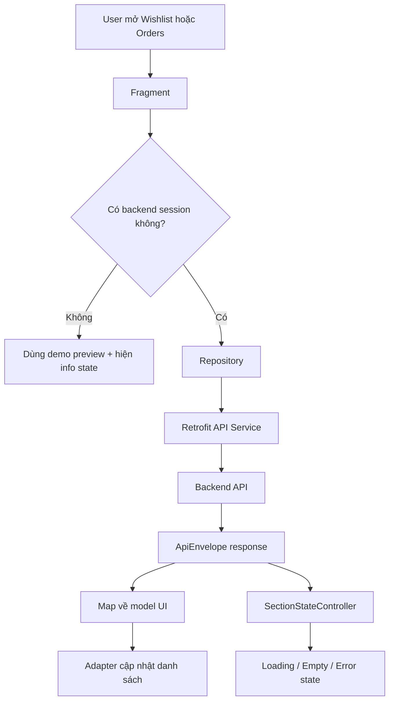

# Wishlist, Orders Và Trạng Thái Loading/Empty/Error Trong Mobile

## 1. Bối cảnh

Sau khi app mobile đã đăng nhập được và đã lấy được danh sách sản phẩm từ backend, bước hợp lý tiếp theo là nối tiếp:

- tab `Wishlist`
- tab `Orders`
- trạng thái hiển thị rõ ràng khi màn hình đang tải, không có dữ liệu, hoặc backend bị lỗi

Nếu bỏ qua phần trạng thái màn hình, app sẽ dễ rơi vào cảm giác “đứng im”, nhất là khi API chậm hoặc trả về danh sách rỗng.

## 2. Khái niệm chính

### `loading state` là gì?

`Loading state` là trạng thái báo cho người dùng biết app đang xử lý dữ liệu.

Ví dụ:

- đang gọi API
- đang chờ backend trả kết quả
- chưa thể vẽ danh sách thật ngay lúc này

Nếu không có loading state, người dùng sẽ tưởng app bị treo.

### `empty state` là gì?

`Empty state` là trạng thái khi request thành công nhưng không có dữ liệu để hiển thị.

Ví dụ:

- wishlist chưa có món nào
- tài khoản chưa có order nào
- backend product list trả về mảng rỗng

Điểm quan trọng là `empty` không phải lỗi.

### `error state` là gì?

`Error state` là trạng thái khi app không lấy được dữ liệu như mong muốn.

Ví dụ:

- backend không chạy
- token hết hạn
- request bị từ chối
- mạng bị lỗi

Lúc này UI nên nói rõ chuyện gì xảy ra và thường nên có nút `Retry`.

## 3. Cách làm trong project này

Project đã thêm một layout dùng lại cho nhiều màn hình:

- `app/src/main/res/layout/layout_content_state.xml`

Layout này chứa:

- `ProgressBar`
- tiêu đề trạng thái
- mô tả trạng thái
- nút hành động tùy chọn

Để điều khiển layout này bằng Java, project dùng:

- `app/src/main/java/com/example/mobile_obs_asm/ui/common/SectionStateController.java`

Lớp này giúp mỗi `Fragment` chỉ cần gọi:

- `showLoading(...)`
- `showMessage(...)`
- `hide()`

Nhờ vậy code UI dễ đọc hơn nhiều so với việc mỗi màn tự bật tắt từng `View`.

## 4. Luồng runtime của tab Wishlist

### Trường hợp 1: Người dùng chưa đăng nhập backend

1. Người dùng mở tab `Wishlist`.
2. `WishlistFragment` kiểm tra `SessionManager.hasActiveSession()`.
3. Nếu chưa có token, app không gọi `/api/wishlist`.
4. Thay vào đó, app dùng dữ liệu demo từ `FakeMarketplaceRepository`.
5. `SectionStateController` hiện thông báo đây chỉ là `demo preview`.
6. UI vẫn có card để xem thử, nhưng người dùng hiểu rõ đây chưa phải dữ liệu thật.

### Trường hợp 2: Người dùng đã đăng nhập backend

1. Người dùng mở tab `Wishlist`.
2. `WishlistFragment` gọi `WishlistRemoteRepository.fetchWishlist(...)`.
3. `WishlistRemoteRepository` dùng `WishlistApiService` để gọi `GET /api/wishlist`.
4. Backend trả về `ApiEnvelope<List<RemoteWishlistItemResponse>>`.
5. Repository map dữ liệu backend sang model `Product` của mobile.
6. Nếu có dữ liệu, `RecyclerView` hiện danh sách.
7. Nếu rỗng, `SectionStateController` hiện empty state.
8. Nếu lỗi, `SectionStateController` hiện error state và nút `Retry`.

## 5. Luồng runtime của tab Orders

1. Người dùng mở tab `Orders`.
2. `OrdersFragment` kiểm tra session.
3. Nếu chưa đăng nhập backend, app hiển thị demo preview order.
4. Nếu đã đăng nhập, `OrdersFragment` gọi `OrderRemoteRepository.fetchMyOrders(...)`.
5. Repository dùng `OrderApiService` để gọi `GET /api/orders/me`.
6. Backend trả về `ApiEnvelope<List<RemoteOrderResponse>>`.
7. Repository map về `OrderPreview`.
8. `OrderAdapter` cập nhật danh sách order card.

Điểm đáng chú ý là:

- timeline order được dựng lại từ các trường thời gian của backend
- màu badge trạng thái được chọn theo `status` hoặc `fundingStatus`

## 6. Luồng runtime của nút Save trong Product Detail

Trước đây nút save chỉ mở preview wishlist.

Bây giờ luồng đã thật hơn:

1. Người dùng mở `ProductDetailActivity`.
2. Nếu sản phẩm đến từ backend thật, nút `Save to wishlist` sẽ gọi `WishlistRemoteRepository.addProduct(...)`.
3. Repository gọi `POST /api/wishlist/{productId}`.
4. Nếu backend thành công, app mở lại tab `Wishlist`.
5. Nếu người dùng chưa đăng nhập backend, app báo rõ cần sign in thay vì giả vờ lưu thành công.

Điều này giúp hành vi của nút save đúng với kỳ vọng của người dùng hơn.

## 7. HomeFragment xử lý state khác gì Wishlist và Orders?

`HomeFragment` có một khác biệt quan trọng:

- product list là API public
- app vẫn có dữ liệu fallback để demo

Vì vậy `HomeFragment` xử lý như sau:

- khi đang sync backend, state card hiện loading
- nếu backend trả dữ liệu thật, danh sách được thay bằng dữ liệu thật
- nếu backend trả rỗng, app hiện empty state
- nếu backend lỗi, app giữ lại những card đang có và hiện error state ở phía trên

Cách làm này giúp màn Home không “trắng màn hình” chỉ vì backend local đang tắt.

## 8. Những file nên đọc nếu muốn theo luồng code

- `app/src/main/java/com/example/mobile_obs_asm/ui/home/HomeFragment.java`
- `app/src/main/java/com/example/mobile_obs_asm/ui/wishlist/WishlistFragment.java`
- `app/src/main/java/com/example/mobile_obs_asm/ui/orders/OrdersFragment.java`
- `app/src/main/java/com/example/mobile_obs_asm/ui/orders/OrderAdapter.java`
- `app/src/main/java/com/example/mobile_obs_asm/ProductDetailActivity.java`
- `app/src/main/java/com/example/mobile_obs_asm/ui/common/SectionStateController.java`
- `app/src/main/java/com/example/mobile_obs_asm/data/WishlistRemoteRepository.java`
- `app/src/main/java/com/example/mobile_obs_asm/data/OrderRemoteRepository.java`
- `app/src/main/java/com/example/mobile_obs_asm/network/wishlist/WishlistApiService.java`
- `app/src/main/java/com/example/mobile_obs_asm/network/order/OrderApiService.java`
- `app/src/main/res/layout/layout_content_state.xml`

## 9. Sơ đồ luồng đơn giản

## 10. Lỗi thường gặp

### Nhầm giữa empty và error

Nếu backend trả về mảng rỗng, đó là `empty`, không phải `error`.

Nếu hiển thị sai, người dùng sẽ nghĩ hệ thống đang hỏng dù thực ra dữ liệu chỉ chưa có.

### Không phân biệt demo mode và signed-in mode

Ở app này có cả:

- `Open demo directly`
- đăng nhập backend thật

Nếu không nói rõ màn nào đang là demo preview, người dùng rất dễ hiểu nhầm dữ liệu demo là dữ liệu thật.

### Gọi API trực tiếp trong Fragment

Điều này làm `Fragment` quá nặng.

Trong project này, networking được đẩy xuống:

- `WishlistRemoteRepository`
- `OrderRemoteRepository`

Nên `Fragment` chỉ còn tập trung vào UI flow.

## 11. Điều quan trọng rút ra

Một màn hình mobile chưa thật sự “xong” khi chỉ có XML đẹp.

Màn đó nên có đủ:

- dữ liệu thật hoặc fallback rõ ràng
- loading state
- empty state
- error state
- hành động tiếp theo hợp lý cho người dùng

Đó là lý do vì sao lần cập nhật này quan trọng: nó biến các tab từ “màn demo tĩnh” thành các màn có hành vi thực tế hơn rất nhiều.
